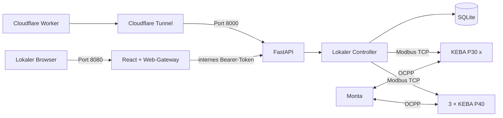

# KEBA Load Manager

[](LICENSE)

Lokales Lastmanagement und Inbetriebnahme-Dashboard für eine KEBA P30 x-series und drei KEBA P40. Die Anwendung liest die Ladestationen über Modbus TCP, speichert Zustände und Ereignisse lokal in SQLite und kann unabhängig von der OCPP-Anbindung an Monta betrieben werden.

> **Regelprinzip:** Im aktiven Betrieb ist der eingestellte Maximalwert die Obergrenze für Gebäude und Ladestationen zusammen. Solange kein Gebäudeverbrauchszähler angebunden ist, rechnet der Controller konservativ mit dem konfigurierten Fallback-Wert: `Ladebudget = Maximalwert − Fallback-Gebäudelast − Regelreserve`. Der Fallback muss mindestens dem plausiblen maximalen gleichzeitigen Gebäudeverbrauch entsprechen; andernfalls kann die reale Anschlussgrenze überschritten werden.

## Funktionen

- React-Dashboard mit Live-Status, Leistungswerten und Ereignisprotokoll
- FastAPI-Backend mit getrenntem Web-Gateway, öffentlicher API und internem Controller
- Modbus-TCP-Abfrage von KEBA P30 x-series und P40
- Vollständige Betriebs- und Gerätetelemetrie: Phasenströme, Spannungen, Leistungsfaktor, Geräte- und Hardwarelimit, Sitzung, RFID-UID, Firmware, Phasen- und Failsafe-Status
- Persistente lokale Konfiguration und Historie in SQLite
- Phasenbewusste Verteilung des verfügbaren Ladebudgets bis zur eingestellten Anschlussgrenze
- Konfigurierbare Fallback-Gebäudelast für den Betrieb ohne Strommessung
- Aktive Modbus-Leistungsfreigaben mit 10-Sekunden-Geräte-Failsafe
- Adaptive Rückgewinnung ungenutzter Ladefreigabe mit Anlaufzeit und Hysterese
- Bedarfserkennung für wartende Fahrzeuge: 6-A-Startsignal, danach vollständige Rückgewinnung mit regelmäßigen Weckversuchen
- Manuelle Ladeanforderung im Dashboard innerhalb aller Anschluss- und Phasengrenzen
- Komplett-Image für `amd64` und `arm64`, auf dem Zielgerät baubar
- Docker Compose mit optionalem Cloudflare-Tunnel
- Weiterbetrieb der Monta-Anbindung für Autorisierung und Abrechnung über OCPP
- Bearer-Schutz für die direkte API und Origin-Prüfung für Schreibanfragen der Oberfläche
- Nicht privilegierter Container mit schreibgeschütztem Root-Dateisystem

## Architektur



Die drei Backend-Prozesse laufen gemeinsam im Anwendungscontainer:

| Port | Dienst | Verwendung |
| --- | --- | --- |
| `8080` | React und lokales Web-Gateway | Lokale Bedienoberfläche ohne Token im Browser |
| `8000` | Geschützte FastAPI | Zugriff durch Cloudflare Worker oder interne Systeme |
| `8091` | Controller | Nur innerhalb des Containers erreichbar |

## Unterstützte Konfiguration

Die mitgelieferte Stationskonfiguration liegt unter [`deploy/config/stations.json`](deploy/config/stations.json):

| Ladepunkt | Modell | Adresse | Modbus-Port |
| --- | --- | --- | --- |
| 1 | KEBA P30 x-series | `192.168.1.71` | `502` |
| 2 | KEBA P40 | `192.168.1.72` | `502` |
| 3 | KEBA P40 | `192.168.1.73` | `502` |
| 4 | KEBA P40 | `192.168.1.74` | `502` |

Die Adressen können vor dem ersten Start in der JSON-Datei oder später über die Inbetriebnahme-Oberfläche geändert werden. Bereits in SQLite gespeicherte Einstellungen haben Vorrang.

## Schnellstart mit Docker

Voraussetzungen sind Docker Engine und Docker Compose v2. Das Docker-Gerät muss die Ladestationen im lokalen Netzwerk über TCP-Port 502 erreichen können.

```bash
git clone https://github.com/philkir/keba-loadmanager.git
cd keba-loadmanager
python3 deploy/init_config.py
docker compose up -d --build backend
```

Anschließend öffnen:

- Oberfläche: <http://127.0.0.1:8080>
- Healthcheck: <http://127.0.0.1:8080/healthz>

Status und Logs:

```bash
docker compose ps
docker compose logs -f backend
```

Die SQLite-Daten liegen im Docker-Volume `keba-loadmanager_keba-data`. `deploy/backend.env` enthält lokale Tokens, wird mit Dateirechten `0600` erzeugt und ist von Git ausgeschlossen.

Eine vollständige Anleitung für Ports, Backups, Umzug und Offline-Images steht in [`DOCKER.md`](DOCKER.md).

## Cloudflare Tunnel

Die Compose-Datei enthält das offizielle, fest versionierte Image `cloudflare/cloudflared:2026.9.1`. Der Tunnel startet über ein eigenes Compose-Profil.

1. In Cloudflare Zero Trust einen remotely-managed Tunnel erstellen.
2. Den Tunnel-Token in `deploy/secrets/cloudflared-token.txt` speichern.
3. Als Tunnel-Service je nach gewünschter Architektur konfigurieren:
   - `http://backend:8000` für den bestehenden Cloudflare Worker als Frontend
   - `http://backend:8080` für die direkt veröffentlichte Container-Oberfläche
4. Den Tunnel starten:

```bash
docker compose --profile tunnel up -d
```

Der veröffentlichte Hostname sollte mit Cloudflare Access geschützt werden. Für die Worker-Variante ist eine Service-Auth-Regel vorgesehen. Die einzelnen Schritte und Worker-Secrets sind in [`DOCKER.md`](DOCKER.md#cloudflare-tunnel-einrichten) beschrieben.

## Lokale Entwicklung

Benötigt werden Python 3.13 oder neuer und Node.js 24 oder neuer.

```bash
python3 -m venv .venv
source .venv/bin/activate
pip install -r backend/requirements.txt
npm ci
python scripts/dev.py --mode commissioning
```

Die Entwicklungsoberfläche läuft anschließend unter <http://127.0.0.1:5173>. Für eine reine Simulation kann `--mode simulation` verwendet werden.

Frontend prüfen und bauen:

```bash
npm run check
npm run build
```

## Projektstruktur

```text
backend/loadmanager/     FastAPI, Controller, Modbus und SQLite
frontend/                React-Oberfläche
worker/                  Cloudflare Worker und API-Weiterleitung
deploy/                  Containerstart, Konfiguration und Secret-Vorlagen
Dockerfile               Multi-Stage-Build für Frontend und Backend
compose.yaml             Backend, Volume und optionaler Cloudflare-Tunnel
DOCKER.md                Ausführliche Betriebs- und Tunnelanleitung
```

## Aktiver Regelbetrieb

Der Regelalgorithmus behandelt `power_limit_kw` als harte Obergrenze. Er versucht innerhalb dieser Grenze stets, die maximal verfügbare Ladeleistung zu nutzen. Gebäudelast und separat eingestellte Regelreserve haben Vorrang; die verbleibende Leistung wird fair und phasenbewusst auf die aktiven Ladepunkte verteilt.

Der Standardmodus neuer Installationen ist `active`. Für Diagnosezwecke steht weiterhin `commissioning` als Nur-Lese-Modus zur Verfügung. Vor dem produktiven Einsatz sind mindestens folgende Schritte erforderlich:

- Fallback-Gebäudelast konservativ auf den maximal plausiblen Verbrauch einstellen
- Anschluss- und Phasengrenzen durch eine Elektrofachkraft prüfen
- KEBA-Schreibregister und Gerätereaktionen für P30 und P40 separat validieren
- 10-Sekunden-Failsafe und Verhalten bei Netzwerk- oder Geräteausfall testen
- Mindeststrom, Phasengrenzen, Reserve und Fairness-Strategie unter realer Last prüfen
- manuellen Rückfallbetrieb und Wiederanlauf definieren
- Installation und Grenzwerte durch eine Elektrofachkraft abnehmen lassen

## Sicherheit

- Lokale Secrets und Datenbanken sind über `.gitignore` und `.dockerignore` ausgeschlossen.
- Der API- und Controller-Zugriff verwendet getrennte, zufällig erzeugte Tokens.
- Der Container läuft als Benutzer `10001`, ohne zusätzliche Capabilities und mit schreibgeschütztem Root-Dateisystem.
- Cloudflare-Tokens werden als Docker-Secret-Datei eingebunden und nicht in Compose gespeichert.
- Der aktuelle Inbetriebnahmemodus setzt keine Modbus-Register.

## Lizenz

Dieses Projekt steht unter der [MIT-Lizenz](LICENSE).

KEBA, Monta und Cloudflare sind Marken ihrer jeweiligen Inhaber. Dieses Projekt ist nicht offiziell mit diesen Unternehmen verbunden.
