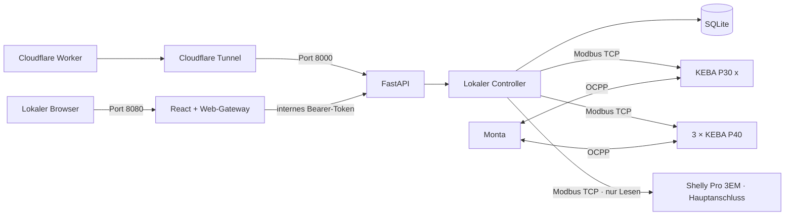

# KEBA Load Manager

[](LICENSE)

Lokales Lastmanagement und Inbetriebnahme-Dashboard für eine KEBA P30 x-series und drei KEBA P40. Die Anwendung liest die Ladestationen über Modbus TCP, speichert Zustände und Ereignisse lokal in SQLite und kann unabhängig von der OCPP-Anbindung an Monta betrieben werden.

> **Regelprinzip:** Im aktiven Betrieb ist der eingestellte Maximalwert die Obergrenze für Gebäude und Ladestationen zusammen. Ein konfigurierbarer Leistungspuffer bis 10 % kann kurzzeitige Spitzen abfangen; Phasengrenzen bleiben harte Grenzen. Ein Shelly Pro 3EM 120A v2 kann den Hauptanschluss inklusive Ladepunkten messen. Die Regelung prüft den direkt gemessenen Spielraum jeder Phase und die Gesamtleistung vor jeder Erhöhung. Befehle zur Reduktion schaffen erst dann neues Budget, wenn der Rückgang tatsächlich gemessen wurde. Ohne aktivierten Zähler gilt `Ladebudget = Maximalwert − Fallback-Gebäudelast − Regelreserve`. Bei Ausfall eines aktivierten Zählers werden 0 A angefordert. Der Fallback muss mindestens dem plausiblen maximalen gleichzeitigen Gebäudeverbrauch entsprechen.

## Funktionen

- React-Dashboard mit Live-Status, Leistungswerten und Ereignisprotokoll
- FastAPI-Backend mit getrenntem Web-Gateway, öffentlicher API und internem Controller
- Modbus-TCP-Abfrage von KEBA P30 x-series und P40
- Hauptanschlussmessung mit Shelly Pro 3EM 120A v2 über Modbus TCP, konfigurierbarer IP und Live-Werten pro Phase
- Vollständige Betriebs- und Gerätetelemetrie: Phasenströme, Spannungen, Leistungsfaktor, Geräte- und Hardwarelimit, Sitzung, RFID-UID, Firmware, Phasen- und Failsafe-Status
- Persistente lokale Konfiguration und Historie in SQLite
- Phasenbewusste Verteilung des verfügbaren Ladebudgets bis zur eingestellten Anschlussgrenze
- Konfigurierbare Fallback-Gebäudelast für den Betrieb ohne Strommessung
- Aktive Modbus-Leistungsfreigaben mit 10-Sekunden-Geräte-Failsafe
- Adaptive Rückgewinnung ungenutzter Ladefreigabe mit Anlaufzeit und Hysterese
- Kontinuierliches 6-A-Startangebot für wartende Fahrzeuge, solange das Budget reicht
- Manuelle Ladeanforderung im Dashboard innerhalb aller Anschluss- und Phasengrenzen
- Komplett-Image für `amd64` und `arm64`, auf dem Zielgerät baubar
- Docker Compose mit optionalem Cloudflare-Tunnel
- Weiterbetrieb der Monta-Anbindung für Autorisierung und Abrechnung über OCPP
- Bearer-Schutz für die direkte API und Origin-Prüfung für Schreibanfragen der Oberfläche
- Nicht privilegierter Container mit schreibgeschütztem Root-Dateisystem

## Architektur


```mermaid
flowchart LR
    Browser[Lokaler Browser] -->|Port 8080| Web[React + Web-Gateway]
    Worker[Cloudflare Worker] --> Tunnel[Cloudflare Tunnel]
    Tunnel -->|Port 8000| API[FastAPI]
    Web -->|internes Bearer-Token| API
    API --> Controller[Lokaler Controller]
    Controller --> DB[(SQLite)]
    Controller -->|Modbus TCP| P30[KEBA P30 x]
    Controller -->|Modbus TCP| P40[3 × KEBA P40]
    Controller -->|Modbus TCP · nur Lesen| Shelly[Shelly Pro 3EM · Hauptanschluss]
    Monta[Monta] <-->|OCPP| P30
    Monta <-->|OCPP| P40
```

Die drei Backend-Prozesse laufen gemeinsam im Anwendungscontainer:

| Port | Dienst | Verwendung |
| --- | --- | --- |
| `8080` | React und lokales Web-Gateway | Lokale Bedienoberfläche ohne Token im Browser |
| `8000` | Geschützte FastAPI | Zugriff durch Cloudflare Worker oder interne Systeme |
| `8091` | Controller | Nur innerhalb des Containers erreichbar |

## Unterstützte Konfiguration

Die mitgelieferte Stationskonfiguration liegt unter [`deploy/config/stations.json`](deploy/config/stations.json):

| Ladepunkt | Modell | Adresse | Modbus-Port |
| --- | --- | --- | --- |
| 1 | KEBA P30 x-series | `192.168.1.71` | `502` |
| 2 | KEBA P40 | `192.168.1.72` | `502` |
| 3 | KEBA P40 | `192.168.1.73` | `502` |
| 4 | KEBA P40 | `192.168.1.74` | `502` |

Die Adressen können vor dem ersten Start in der JSON-Datei oder später über die Inbetriebnahme-Oberfläche geändert werden. Bereits in SQLite gespeicherte Einstellungen haben Vorrang.

## Shelly-Hauptanschlussmessung

Unter **Einstellungen → Hauptanschluss · Shelly Pro 3EM 120A v2** lassen sich IP-Adresse, TCP-Port und Modbus Unit-ID konfigurieren. Vorbelegt sind `192.168.1.217`, Port `502` und Unit-ID `1`. Die Messung ist zunächst deaktiviert; bestehende Installationen behalten dadurch ihren bisherigen Fallback-Betrieb. Einstellungen werden in SQLite gespeichert und beim Neustart wieder geladen.

1. Der Shelly muss den gesamten Hauptanschluss **einschließlich aller geregelten Ladepunkte** erfassen. Die Phasen A/B/C müssen der L1/L2/L3-Reihenfolge aller Wallboxen entsprechen; bei Netzbezug muss die Wirkleistung positiv sein.
2. Im Shelly Modbus TCP aktivieren und das Profil `triphase` verwenden. Die passenden 120-A-Stromwandler konfigurieren, sofern die Firmware eine Auswahl anbietet. Shelly und Regler benötigen eine synchronisierte Gerätezeit (NTP).
3. IP-Adresse prüfen, **Hauptanschlussmessung aktivieren** einschalten und **Messung speichern** wählen. Im Modus `commissioning` können Messwerte vorab geprüft werden, ohne Ladefreigaben zu schreiben.
4. Netzbezug, Phasenströme und Spannungen mit der Shelly-Oberfläche vergleichen. In `active` fließen die Werte direkt in die Regelung ein.

Der Adapter liest ausschließlich Input-Register mit Funktion 04: Offset `1000`, 80 Register für die EM-Komponente. Die dokumentierte Adresse `31000` entspricht dem Offset `1000`; 32-Bit-Werte verwenden die Wortreihenfolge CDAB. Grundlage sind die offiziellen [Modbus-](https://shelly-api-docs.shelly.cloud/gen2/ComponentsAndServices/Modbus/) und [EM-Registerbeschreibungen](https://shelly-api-docs.shelly.cloud/gen2/ComponentsAndServices/EM/).

Die angezeigte Netto-Gebäudelast ist die Hauptanschlussleistung abzüglich der gemessenen Ladeleistung. Die konservative Rückrechnung der Gebäudeströme bleibt als Diagnose verfügbar. Für die Regelung wird der direkt gemessene Netzstrom plus der noch nicht ausgeschöpfte bzw. neu freizugebende Ladestrom verwendet. Dadurch werden Schwankungen der rechnerischen Wirk-/Blindleistungsverteilung nicht als sprunghaft wechselnde Gebäudelast geregelt. Eine Differenz von Effektivströmen wird nicht als physikalische Gebäudestrommessung ausgegeben. Einspeisung bleibt in Anzeige und Verlauf negativ; die Regelung vergibt dafür kein zusätzliches Leistungsbudget. Höhere gemessene Spannungen werden beim Leistungsbudget berücksichtigt. Vor einer Umverteilung wartet der Regler auf tatsächlich gesunkene Ladeströme.

Ein einzelner Kommunikationsfehler wird innerhalb eines auf zwei Sekunden begrenzten Shelly-Leseversuchs wiederholt. Kurze Kommunikationslücken halten bestehende Freigaben, solange die letzte vollständige Messung höchstens fünf Sekunden alt ist; Erhöhungen sind gesperrt. Ungültige Werte, Phasenfehler und ältere Messungen führen weiterhin zum sicheren Halt. Veraltete Werte bleiben ausdrücklich als letzte gültige Messung sichtbar, werden aber nicht als neue Historienpunkte gespeichert. Der Fallback wird bei aktiviertem Zähler nicht automatisch verwendet.

Wallbox-Abfragen lesen zuerst die Regelwerte. Optionale Geräteinformationen werden in kleinen Gruppen mit eigenem Zeitlimit aktualisiert. Die Shelly-Abfrage folgt anschließend, damit sie für die Regelentscheidung aktuell ist. Der veröffentlichte Status trägt den Abschlusszeitpunkt des Regelzyklus. Ein bestätigter KEBA-Failsafe wird bei Wiederverbindung weiterverwendet, ohne künstlichen 0-A-Impuls.

### Ruhiger Regelbetrieb

- Neue Sitzungen beginnen mit 6 A und mindestens 1 A zusätzlichem Spielraum. Laufende Sitzungen werden nicht durch die Warteplatzrotation verdrängt.
- Standardmäßig steigt die Freigabe um höchstens 1 A je 10 Sekunden, erst bei anhaltend freiem Budget. `ramp_up_seconds` ist zwischen 5 und 60 Sekunden konfigurierbar.
- Kurzzeitige Laständerungen werden acht Sekunden über Reserve bzw. konfigurierten Leistungspuffer abgefangen. Danach sinkt die Freigabe um 1 A je fünf Sekunden. Anschluss- und Phasengrenzen übersteuern diese Verzögerung sofort.
- Nach einem notwendigen Stopp gilt eine Wiederanlaufpause von 30 Sekunden (`restart_delay_seconds`, 10–300 Sekunden). Eine ausdrücklich aufgehobene manuelle Pause darf sofort wieder starten.
- Es gibt keine periodischen 0/6-A-Weckzyklen mehr. Ein nicht ladendes Fahrzeug darf ein 6-A-Angebot behalten, solange die Kapazität reicht; dafür steht zeitweise weniger Spitzenleistung für andere Fahrzeuge zur Verfügung.

### Edyna-Leistungspuffer

`power_limit_kw` ist das normale Regelziel. `power_tolerance_pct` (Standard 0, maximal 10 %) erweitert ausschließlich die Leistungsobergrenze für Spitzen; neue Leistung wird weiterhin unterhalb des Regelziels abzüglich Reserve vergeben. Bei 25 kW und 10 % beträgt die Obergrenze 27,5 kW. `phase_limit_a` wird dadurch nicht erhöht und muss der tatsächlichen Installation entsprechen.

Laut [Edyna-Zähleranleitung, Seite 5](https://www.edyna.net/fileadmin/filemount/Pdf/05_clienti/Smart_meter/Technische_Anleitung_Smart_Meter.pdf) stehen 10 % über der vertraglichen Leistung ohne Zeitbeschränkung zur Verfügung. Die Anleitung nennt außerdem zeitlich begrenzte höhere Entnahmen am Beispiel eines 3-kW-Anschlusses. Diese darüber hinausgehenden Abschaltkurven werden hier nicht auf andere Anschlüsse extrapoliert. Vertragsleistung, verfügbare Leistung und reale Vorsicherung müssen zusammenpassen; ein Zählerlimiter ersetzt keinen Leitungsschutz.


## Schnellstart mit Docker

Voraussetzungen sind Docker Engine und Docker Compose v2. Das Docker-Gerät muss die Ladestationen im lokalen Netzwerk über TCP-Port 502 erreichen können.

```bash
git clone https://github.com/philkir/keba-loadmanager.git
cd keba-loadmanager
python3 deploy/init_config.py
docker compose up -d --build backend
```

Anschließend öffnen:

- Oberfläche: <http://127.0.0.1:8080>
- Healthcheck: <http://127.0.0.1:8080/healthz>

Status und Logs:

```bash
docker compose ps
docker compose logs -f backend
```

Die SQLite-Daten liegen im Docker-Volume `keba-loadmanager_keba-data`. `deploy/backend.env` enthält lokale Tokens, wird mit Dateirechten `0600` erzeugt und ist von Git ausgeschlossen.

Eine vollständige Anleitung für Ports, Backups, Umzug und Offline-Images steht in [`DOCKER.md`](DOCKER.md).

## Cloudflare Tunnel

Die Compose-Datei enthält das offizielle, fest versionierte Image `cloudflare/cloudflared:2026.9.1`. Der Tunnel startet über ein eigenes Compose-Profil.

1. In Cloudflare Zero Trust einen remotely-managed Tunnel erstellen.
2. Den Tunnel-Token in `deploy/secrets/cloudflared-token.txt` speichern.
3. Als Tunnel-Service je nach gewünschter Architektur konfigurieren:
   - `http://backend:8000` für den bestehenden Cloudflare Worker als Frontend
   - `http://backend:8080` für die direkt veröffentlichte Container-Oberfläche
4. Den Tunnel starten:

```bash
docker compose --profile tunnel up -d
```

Der veröffentlichte Hostname sollte mit Cloudflare Access geschützt werden. Für die Worker-Variante ist eine Service-Auth-Regel vorgesehen. Die einzelnen Schritte und Worker-Secrets sind in [`DOCKER.md`](DOCKER.md#cloudflare-tunnel-einrichten) beschrieben.

## Lokale Entwicklung

Benötigt werden Python 3.13 oder neuer und Node.js 24 oder neuer.

```bash
python3 -m venv .venv
source .venv/bin/activate
pip install -r backend/requirements.txt
npm ci
python scripts/dev.py --mode commissioning
```

Die Entwicklungsoberfläche läuft anschließend unter <http://127.0.0.1:5173>. Für eine reine Simulation kann `--mode simulation` verwendet werden.

Frontend prüfen und bauen:

```bash
npm run check
npm run build
```

## Projektstruktur

```text
backend/loadmanager/     FastAPI, Controller, Modbus und SQLite
frontend/                React-Oberfläche
worker/                  Cloudflare Worker und API-Weiterleitung
deploy/                  Containerstart, Konfiguration und Secret-Vorlagen
Dockerfile               Multi-Stage-Build für Frontend und Backend
compose.yaml             Backend, Volume und optionaler Cloudflare-Tunnel
DOCKER.md                Ausführliche Betriebs- und Tunnelanleitung
```

## Aktiver Regelbetrieb

Der Regelalgorithmus nähert sich `power_limit_kw` mit schrittweisen Stromänderungen. Die harte Leistungsobergrenze ergibt sich aus Regelziel und dem ausdrücklich konfigurierten Leistungspuffer. Gebäudelast und separat eingestellte Regelreserve haben Vorrang; die verbleibende Leistung wird fair und phasenbewusst auf die aktiven Ladepunkte verteilt.

Der Standardmodus neuer Installationen ist `active`. Für Diagnosezwecke steht weiterhin `commissioning` als Nur-Lese-Modus zur Verfügung. Vor dem produktiven Einsatz sind mindestens folgende Schritte erforderlich:

- Fallback-Gebäudelast konservativ auf den maximal plausiblen Verbrauch einstellen
- Bei Shelly-Betrieb Messposition, Phasenzuordnung, Bezugsvorzeichen und Messausfall mit sicherem Halt prüfen
- Anschluss- und Phasengrenzen durch eine Elektrofachkraft prüfen
- KEBA-Schreibregister und Gerätereaktionen für P30 und P40 separat validieren
- 10-Sekunden-Failsafe und Verhalten bei Netzwerk- oder Geräteausfall testen
- Mindeststrom, Phasengrenzen, Reserve und Fairness-Strategie unter realer Last prüfen
- manuellen Rückfallbetrieb und Wiederanlauf definieren
- Installation und Grenzwerte durch eine Elektrofachkraft abnehmen lassen

## Sicherheit

- Lokale Secrets und Datenbanken sind über `.gitignore` und `.dockerignore` ausgeschlossen.
- Der API- und Controller-Zugriff verwendet getrennte, zufällig erzeugte Tokens.
- Der Container läuft als Benutzer `10001`, ohne zusätzliche Capabilities und mit schreibgeschütztem Root-Dateisystem.
- Cloudflare-Tokens werden als Docker-Secret-Datei eingebunden und nicht in Compose gespeichert.
- Der aktuelle Inbetriebnahmemodus setzt keine Modbus-Register.

## Lizenz

Dieses Projekt steht unter der [MIT-Lizenz](LICENSE).

KEBA, Monta und Cloudflare sind Marken ihrer jeweiligen Inhaber. Dieses Projekt ist nicht offiziell mit diesen Unternehmen verbunden.
